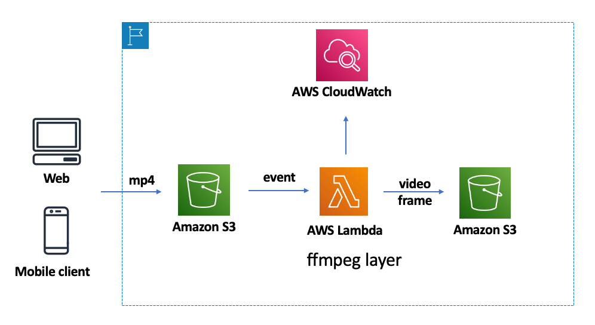

# serverless-video-thumbnails-golang

## Architectures

* The client uploads the video file to the s3 bucket
* Trigger the Lambda function through s3 events and execute ffmpeg for frame extraction
* Save the resulting picture of the frame drawing to the specified directory and upload it to s3
